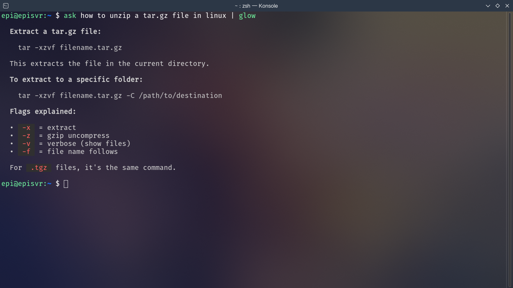

# Ask & Aura

本地向大语言模型发起单轮提问的命令行与桌面工具。


中文 | [English](README-en.md)

## 定位

日常使用中，我们常会碰到一些一时记不清的小问题，比如 `strcmp` 的返回值含义，或者如何快速解压 tar.gz 文件。此时，与其打开浏览器再去找大模型提问，不如直接用本工具快速、优雅地获得答案，省时省力。


- **Ask**：命令行工具，支持管道输入。


- **Aura**：基于 GTK4 的桌面 GUI，支持流式渲染。

## 特性

- 🚀 **快速**：Rust 编写，启动和响应都很快。
- 🛠 **可配置**：支持自定义 API Key、模型、API 地址等。
- 🖥 **轻量 GUI**：原生桌面体验，操作便捷。

## 使用方法

### 命令行（Ask）

```bash
# 单次提问
ask -m "如何用 Python 翻转一个列表？"

# 简单对话（暂不支持一些命令行的特殊符号）
ask how to unzip a targz file with tar

# 管道输入（在有管道附加的时候必须加 -m 参数来附加消息）
cat src/main.rs | ask -m "解释这段代码的作用"

# 自定义系统提示词
ask --prompt "你是一名诗人" "写一首关于 Rust 的诗"
```

建议配合 `glow` 美化输出。

### 桌面 GUI（Aura）

- 在输入框中提问，按 `Enter` 获取流式回答。
- 按 `↑` / `↓` 切换历史问题。
- 按 `Esc` 退出，窗口失去焦点时自动隐藏。
- 支持基础 Markdown 渲染。

历史记录仅保存在内存中，程序退出即清空。**每次提问均为独立请求**，不保留跨会话的上下文。

## 快速开始

### 手动编译

依赖：Rust、GTK4（Debian/Ubuntu 安装 `libgtk-4-dev`，Arch 安装 `gtk4`）、OpenSSL（`libssl-dev`）

```bash
git clone https://github.com/episvr/ask.git
cd ask
make install
```

工具会被安装到 `~/.local/bin`，同时添加桌面快捷方式。
请确保 `~/.local/bin` 已加入 `PATH`，也可根据需要修改 Makefile。

## 配置

配置文件路径：`~/.config/ask/config.toml`

system_prompt 是可选配置参数，你可以自由的定义大模型的回复风格。

```toml
api_key = "sk-..."
model = "gpt-4o"
api_base = "https://your-custom-endpoint.com/v1"

system_prompt = "your amazing prompt here"
```

## 贡献

欢迎提交 Pull Request。如有重大变更，请先开 Issue 讨论。

## 许可证

[MIT](LICENSE)